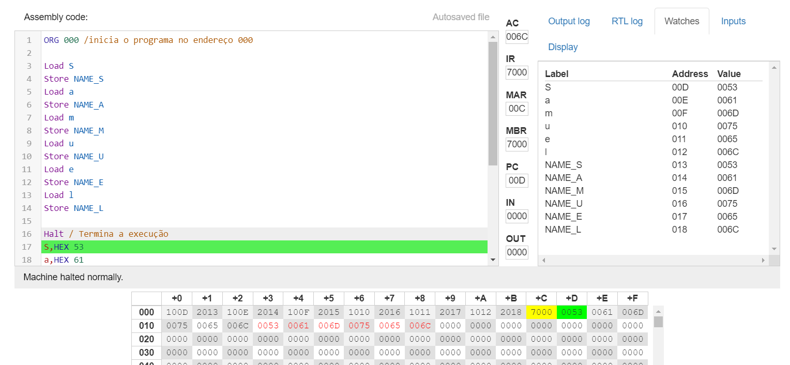

# Projeto de Aprendizado em Assembly

## Objetivo do Projeto
Este projeto visa fornecer um ambiente para aprender e praticar a linguagem Assembly. O objetivo é entender os conceitos fundamentais de programação em baixo nível e como os programas interagem com a arquitetura do computador.

## Estrutura do Projeto
O projeto está organizado da seguinte forma:

1. **Documentação:**
   - `README.md`: Este arquivo fornece uma visão geral do projeto, instruções de instalação e uso, bem como recursos adicionais para aprender Assembly.
   - Outros documentos podem ser adicionados conforme necessário.

2. **Código-fonte:**
   - `src/`: Este diretório contém todos os arquivos de código-fonte escritos em Assembly.
   - Os arquivos são organizados de acordo com os conceitos ou exercícios abordados.

## Como Usar
1. **Instalação:**
   - Não é necessária nenhuma instalação especial, já que a linguagem Assembly geralmente é escrita em arquivos de texto simples e montada usando um montador adequado.

2. **Execução:**
   - Dependendo do sistema operacional e do hardware, os programas Assembly podem ser executados de diferentes maneiras. Consulte a documentação do seu ambiente de desenvolvimento para obter instruções específicas.

## Recursos Adicionais
- [Introdução à Linguagem Assembly](https://pt.wikipedia.org/wiki/Linguagem_assembly)
- [Tutorial de Assembly para Iniciantes](https://www.tutorialspoint.com/assembly_programming/index.htm)
- [Livro: Assembly Language Step-by-Step](https://www.amazon.com/Assembly-Language-Step-Step-Programming/dp/0470497025)
## Atividades 
1. **Alocação de memória dinâmica**
   - A alocação de memória dinâmica é um processo que permite reservar espaço na memória do computador conforme necessário durante a execução de um programa. Isso é útil quando você não sabe com antecedência o tamanho exato que o espaço de memória precisará ter.
   No código fornecido, a alocação de memória é realizada de forma estática, onde espaço é reservado para cada caractere do nome "Samuel" em uma posição específica da memória. Isso é feito atribuindo valores hexadecimais correspondentes a cada letra do nome.
   Por exemplo, o caractere 'S' é associado ao valor hexadecimal '53', 'a' ao valor '61', 'm' ao valor '6D', 'u' ao valor '75', 'e' ao valor '65' e 'l' ao valor '6C'. Cada um desses valores é armazenado em uma posição de memória reservada para o respectivo caractere do nome "Samuel".
   Essa abordagem funciona bem quando o tamanho do nome é conhecido antecipadamente e é estático durante a execução do programa. No entanto, em situações onde o tamanho do nome pode variar ou não é conhecido antecipadamente, é mais comum usar técnicas de alocação de memória dinâmica, como a função malloc() em linguagens de programação de alto nível ou chamadas de sistema específicas em Assembly.

   -  

2. **DOS em assembly**
   - Em Assembly, "DOS" refere-se ao "Disk Operating System", um sistema operacional de disco amplamente utilizado em computadores pessoais durante os anos 1980 e parte dos anos 1990. No contexto de Assembly, "DOS" pode se referir a programas escritos para o sistema operacional MS-DOS (Microsoft Disk Operating System) ou PC-DOS (IBM Personal Computer Disk Operating System). Esses programas geralmente interagem diretamente com o hardware do computador e acessam recursos como a tela, teclado e disco diretamente por meio de interrupções do sistema operacional ou chamadas de BIOS (Basic Input/Output System).

   - [Clique aqui para acessar o arquivo print.asm](print.asm)
 
   - **Funcinamento dos registradores**
    Os registradores são pequenas unidades de armazenamento dentro do processador que mantêm dados temporários e endereços de memória. Eles são essenciais para operações rápidas e eficientes, armazenando dados temporários, endereços de memória e sinais de status do processador. Cada registrador tem uma função específica, como armazenar dados, apontar para a próxima instrução ou armazenar sinais de status.

## Contribuições
Contribuições são bem-vindas! Sinta-se à vontade para abrir issues, enviar solicitações de pull ou adicionar recursos úteis à documentação.

## Autor
Este projeto foi criado por Samuel Matsuo.
